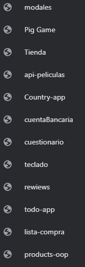

### Enlace al fichero en servidor
https://luis.certweb.infenlaces.com/ventanas-modales/

### Enlace al fichero en github
https://github.com/luisferlie/ventanas-modales

### Enlace a otros ficheros en github

https://github.com/luisferlie/js-ejercicios

Estos ficheros estan también instalados en el servidor(carpetas) realizados por mi y subidos tambien a la cuenta de github:

 enlaces

 https://luis.certweb.infenlaces.com/cockteles/
 https://luis.certweb.infenlaces.com/pig-game/
 https://luis.certweb.infenlaces.com/store/
 https://luis.certweb.infenlaces.com/api-peliculas/
 https://luis.certweb.infenlaces.com/Country-app/
 https://luis.certweb.infenlaces.com/cuentaBancaria/
https://luis.certweb.infenlaces.com/cuestionario/
https://luis.certweb.infenlaces.com/teclado/
https://luis.certweb.infenlaces.com/reviews/
https://luis.certweb.infenlaces.com/todo-app/
https://luis.certweb.infenlaces.com/lista-compra/
https://luis.certweb.infenlaces.com/products-oop/

